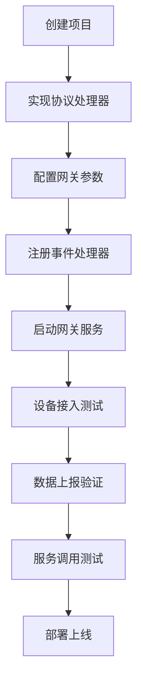

# SagooIOT 网关 SDK 文档中心

欢迎使用 SagooIOT 网关 SDK！本文档中心提供了完整的开发指南和参考资料，帮助您快速上手并开发出高质量的IoT网关应用。

## 📚 文档导航

### 🚀 快速开始
- **[开发手册](./developer-guide.md)** - 完整的开发指南，从入门到精通
- **[快速参考](./quick-reference.md)** - 常用API和代码片段速查
- **[协议开发指南](./protocol-development.md)** - 详细的协议处理器开发教程

### 📖 核心概念

#### 网关架构
- 整体架构设计
- 核心组件介绍
- 数据流向说明

#### 协议处理
- 协议接口定义
- 数据解析与编码
- 错误处理机制

#### 事件系统
- 事件驱动架构
- 数据上报机制
- 服务调用处理

#### MQTT集成
- 连接管理
- Topic规范
- 数据格式

### 🛠️ 开发指南

#### 环境搭建
```bash
# 安装SDK
go get -u github.com/sagoo-cloud/iotgateway

# 创建项目
mkdir my-gateway && cd my-gateway
go mod init my-gateway
```

#### 最小示例
```go
package main

import (
    "github.com/gogf/gf/v2/os/gctx"
    "github.com/sagoo-cloud/iotgateway"
)

func main() {
    ctx := gctx.GetInitCtx()
    gateway, _ := iotgateway.NewGateway(ctx, nil)
    gateway.Start()
}
```

### 📋 功能特性

| 特性 | 描述 | 文档链接 |
|------|------|----------|
| 🌐 多协议支持 | TCP、UDP、MQTT等多种网络协议 | [网络层开发](./developer-guide.md#网络层开发) |
| 🔧 可扩展架构 | 插件化的协议处理器设计 | [协议开发](./protocol-development.md) |
| 📡 MQTT集成 | 与SagooIOT平台无缝集成 | [MQTT集成](./developer-guide.md#mqtt集成) |
| 🎯 事件驱动 | 基于事件的异步处理机制 | [事件系统](./developer-guide.md#事件系统) |
| 🛡️ 高可靠性 | 内置连接管理、错误恢复、内存优化 | [最佳实践](./developer-guide.md#最佳实践) |
| 📊 监控友好 | 完善的日志和统计信息 | [故障排查](./developer-guide.md#故障排查) |

### 🎯 使用场景

#### 工业物联网
- 工厂设备数据采集
- 生产线监控
- 设备状态管理

#### 智能家居
- 家电设备接入
- 环境监测
- 安防系统

#### 智慧城市
- 路灯控制
- 环境监测
- 交通管理

### 📝 开发流程



### 🔧 配置示例

#### 基础配置
```yaml
server:
  name: "IoT网关"
  addr: ":8080"
  netType: "tcp"
  productKey: "your_product_key"
  deviceKey: "your_device_key"

mqtt:
  address: "tcp://localhost:1883"
  username: "username"
  password: "password"
  clientId: "gateway_client"
```

#### 高级配置
```yaml
server:
  packetConfig:
    type: 3  # 分隔符处理
    delimiter: "\r\n"
  duration: 60s

mqtt:
  keepAliveDuration: 30s
  clientCertificateKey: "path/to/key.pem"
  clientCertificateCert: "path/to/cert.pem"
```

### 📊 性能指标

| 指标 | 数值 | 说明 |
|------|------|------|
| 并发连接数 | 10,000+ | 单实例支持的最大设备连接数 |
| 消息吞吐量 | 50,000 msg/s | 每秒处理的消息数量 |
| 内存占用 | < 100MB | 基础运行时内存占用 |
| 响应延迟 | < 10ms | 平均消息处理延迟 |

### 🚨 常见问题

#### Q: 设备连接不上网关？
**A:** 检查网络配置、防火墙设置和协议实现。详见 [故障排查](./developer-guide.md#故障排查)

#### Q: 数据解析失败？
**A:** 验证数据格式、协议实现和日志输出。参考 [协议开发](./protocol-development.md)

#### Q: MQTT连接异常？
**A:** 检查服务器地址、认证信息和证书配置。查看 [MQTT集成](./developer-guide.md#mqtt集成)

#### Q: 内存使用过高？
**A:** 启用缓存清理、检查设备离线处理。参考 [最佳实践](./developer-guide.md#最佳实践)

### 📞 技术支持

- **QQ群**: 686637608
- **微信公众号**: sagoocn
- **在线文档**: [iotdoc.sagoo.cn](https://iotdoc.sagoo.cn)

### 📄 许可证

本项目采用 MIT 许可证，详情请查看 [LICENSE](../LICENSE) 文件。

---

## 🎉 开始您的IoT网关开发之旅

选择适合您的文档开始学习：

1. **新手入门** → [开发手册](./developer-guide.md)
2. **快速查阅** → [快速参考](./quick-reference.md)  
3. **协议开发** → [协议开发指南](./protocol-development.md)

祝您开发愉快！🚀 